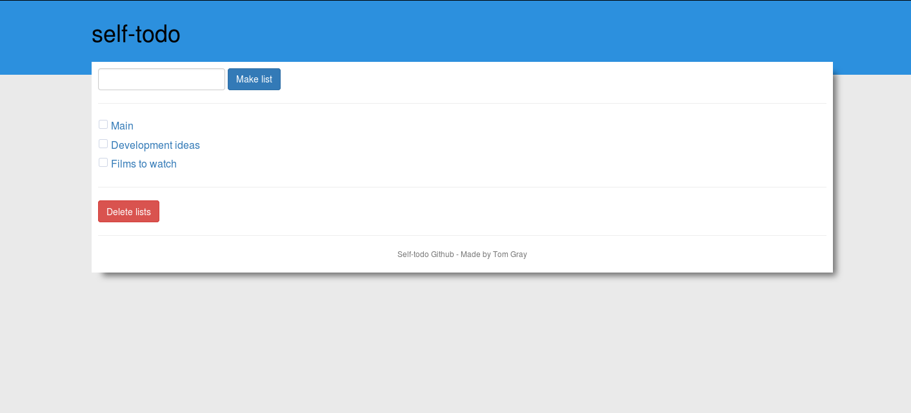
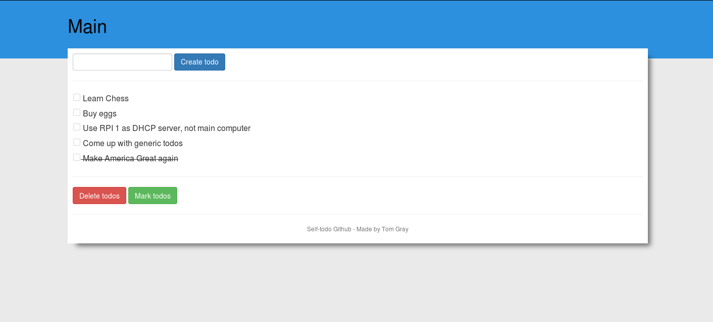

# self-todo
## Todo lists

## Todos

## A simple self hosted todo list

self-todo is a self-hosted todo lists manager that makes use of oursql3
to access a sql server with the todos, it has a simple web frontend and a 
command line client

### Dependencies:
* mysql-server
* oursql3
* flask

### How to use it
Firstly you will need to set up a databse with the correct schema (found in dump.sql)
This schema can created in the database by running 

```
$ mysql -e "CREATE DATABSE IF NOT EXISTS self_todo" -u username -p
$ mysql -u username -p self_todo < dump.sql
```

You can change the name of the database if you want to however you will also have
to update the dbName in the db section of the config file

If you would like to run the client then run the command `python src/main.py`, help
is available via the help command
